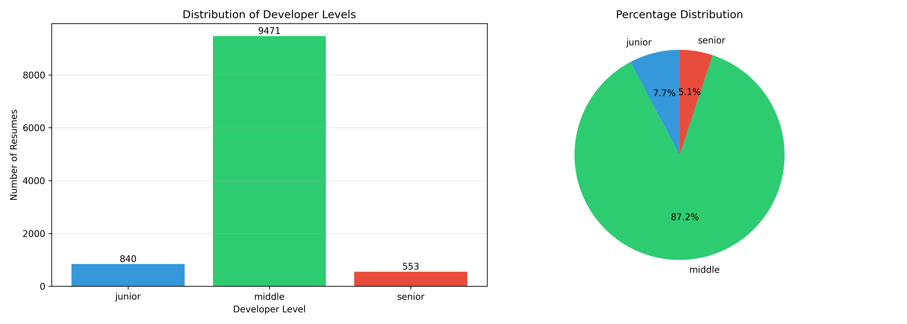
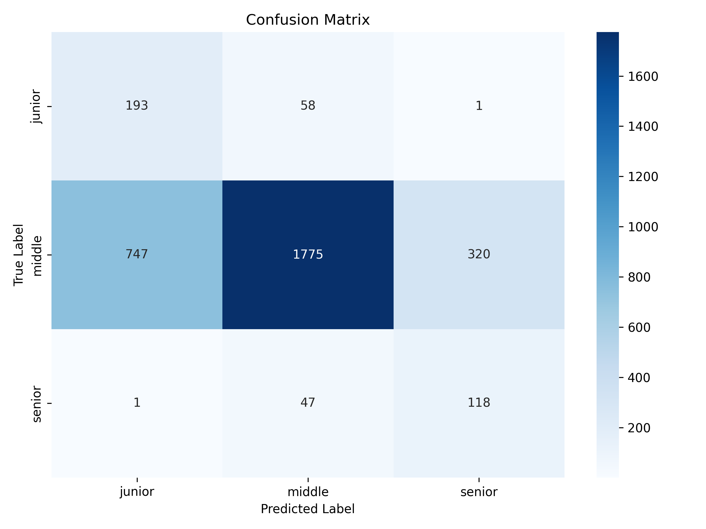
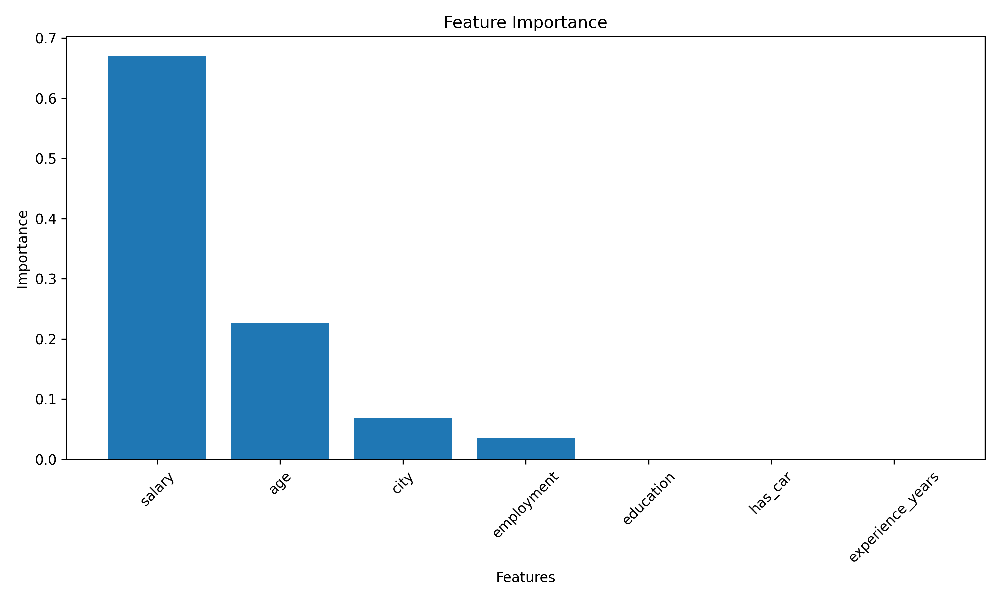

# Классификация

## Установка

```bash
pip install -r requirements.txt
```

## Использование

### Шаг 1: Предобработка данных

```bash
python3 pipeline_app.py example/hh.csv
```

Создаёт два файла в директории с исходным CSV:
- `x_data.npy` - матрица признаков (n_samples, 7)
- `y_data.npy` - вектор уровней (n_samples,) ['junior', 'middle', 'senior']

**Что делает пайплайн:**
1. Загружает CSV с резюме
2. Фильтрует только IT-разработчиков (11,052 из 66,945)
3. Создаёт целевую переменную на основе:
   - Явного указания уровня в названии должности
   - Опыта работы: < 2 лет → junior, 2-5 лет → middle, > 5 лет → senior
4. Извлекает признаки: возраст, зарплата, опыт, город, образование, занятость, авто
5. Кодирует категориальные признаки (LabelEncoder)
6. Нормализует численные признаки (StandardScaler)
7. Сохраняет результаты в x_data.npy и y_data.npy

### Шаг 2: Обучение и оценка модели

```bash
python3 app.py example/x_data.npy example/y_data.npy
```

**Что делает классификатор:**
1. Загружает обработанные данные
2. Строит графики баланса классов
3. Разбивает данные на train/test (70%/30%)
4. Обучает Random Forest классификатор
5. Выводит classification report (precision, recall, F1)
6. Создаёт визуализации (confusion matrix, feature importance)
7. Анализирует качество модели и причины ошибок

## Результаты

### Данные
- **Всего резюме:** 66,945
- **IT-разработчиков найдено:** 11,052 (16.5%)

### Распределение классов
- **Middle:** 9,630 (87.1%)
- **Junior:** 854 (7.7%)
- **Senior:** 568 (5.1%)

### Метрики модели

```
              precision    recall  f1-score   support

      junior       0.21      0.75      0.33       256
      middle       0.95      0.64      0.76      2889
      senior       0.30      0.80      0.44       171

    accuracy                           0.65      3316
   macro avg       0.49      0.73      0.51      3316
weighted avg       0.86      0.65      0.71      3316
```

- **Accuracy:** 65.3%
- **Macro F1-Score:** 50.7%

### Важность признаков

1. **Зарплата:** 66.25% - ключевой индикатор уровня
2. **Возраст:** 23.16% - коррелирует с опытом
3. **Город:** 7.06% - региональные различия
4. **Тип занятости:** 3.52%
5. Остальные признаки: < 1%

## Выводы

### 1. Качество модели

Модель показывает разумное качество
- F1-score 51% для macro-average указывает на способность различать уровни
- Accuracy 65.3% подтверждает общую корректность классификации

### 2. Возможные причины ошибок

**a) Дисбаланс классов**
- Middle значительно преобладает (87%), что создаёт bias в сторону этого класса
- Junior и Senior недостаточно представлены для качественного обучения
- Использовали `class_weight='balanced'` для частичной компенсации

**b) Качество разметки**
- Автоматическая разметка на основе названия должности и опыта
- Названия должностей не всегда отражают реальный уровень
- Неоднозначность в различении middle и senior

**c) Важность признаков**
- Зарплата - доминирующий признак (66%), но может вводить в заблуждение из-за региональных различий
- Опыт работы не показал высокой важности (возможно, из-за корреляции с возрастом)
- Отсутствие NLP-анализа навыков и технологий ограничивает точность


### Classifier (обучение и оценка)
Работает с обработанными данными:
- Обучение Random Forest
- Визуализация результатов
- Оценка качества
- Анализ ошибок

## Технические детали

**Алгоритм:** Random Forest Classifier (100 деревьев, глубина 10)

**Параметры:**
- `n_estimators=100`
- `max_depth=10`
- `class_weight='balanced'`
- `random_state=42`

**Разбиение данных:** 70% train / 30% test с стратификацией

# Приложение






